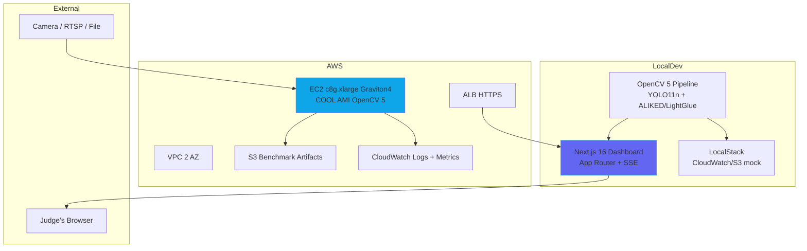

# Gravisonde Architecture Overview

```mermaid
flowchart TB
    subgraph External
        Judge[Judge's Browser]
        Camera[Camera / RTSP / File]
    end

    subgraph AWS
        VPC[VPC 2 AZ]
        EC2[EC2 c8g.xlarge Graviton4<br/>COOL AMI OpenCV 5]
        S3[S3 Benchmark Artifacts]
        CW[CloudWatch Logs + Metrics]
        ALB[ALB HTTPS]
    end

    subgraph LocalDev
        Dashboard[Next.js 16 Dashboard<br/>App Router + SSE]
        Pipeline[OpenCV 5 Pipeline<br/>YOLO11n + ALIKED/LightGlue]
        LS[LocalStack<br/>CloudWatch/S3 mock]
    end

    Camera --> EC2
    EC2 --> CW
    EC2 --> S3
    ALB --> Dashboard
    Dashboard --> Judge
    Pipeline --> Dashboard
    Pipeline --> LS

    style EC2 fill:#0ea5e9,stroke:#6366f1
    style Dashboard fill:#6366f1,stroke:#0ea5e9
```

**Layers**
1. Camera → EC2 Graviton4 COOL AMI
2. OpenCV 5 DNN + Features2D
3. Telemetry → CloudWatch + S3
4. Next.js 16 Dashboard SSE
5. Judge browser live view
